<!--
 * @Author: XQ
 * @Date: 2024-11-19 10:37:22
 * @LastEditTime: 2024-12-06 16:44:42
 * @LastEditors: XQ
 * @Description: 
 * @FilePath: \undefinedd:\xuqiang\github\Kanzi-Demos\readme.md
-->
# 介绍
本仓库主要是前期学习Kanzi技术的一个过程记录
本仓库是基于Kanzi教程中特殊功能模块和案例进行学习。

# 仓库分类介绍和说明
## 基础向导
### Getting Started
在本仓库的这一步中主要学习：  
- 熟悉Kanzi里面的一些简单流程
- 按钮 
- 状态切换 
- 属性控制 
- 资源加载 


### First Application
在本仓库的这一步中主要学习：  
- 属性
- Kanzi状态切换 
- Trajectory List Box使用 
- 效卡片制作 
- 布局  
  
### Activity
在本仓库的这一步中主要学习：

- 关于不同类型的Activity节点

- 如何使用活动浏览器创建具有活动节点的应用程序结构

- 如何使用状态管理器控制活动节点的激活状态

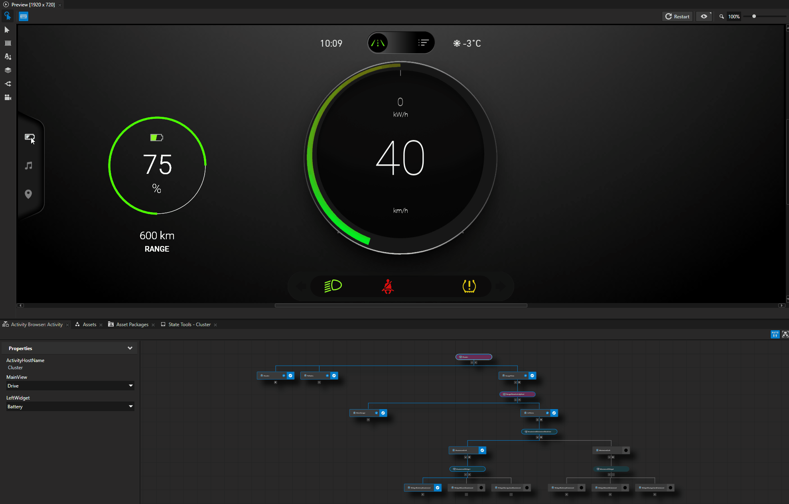

### Data Triger
在本仓库的这一步中主要学习：
- 如何使用条件来控制应用程序 UI
- 如何通过创建弹出窗口来控制组成 UI 的活动的激活状态，应用程序仅在满足数据触发器中的条件时才会显示这些弹出窗口
- 绑定表达式的形式在数据触发器中设置条件

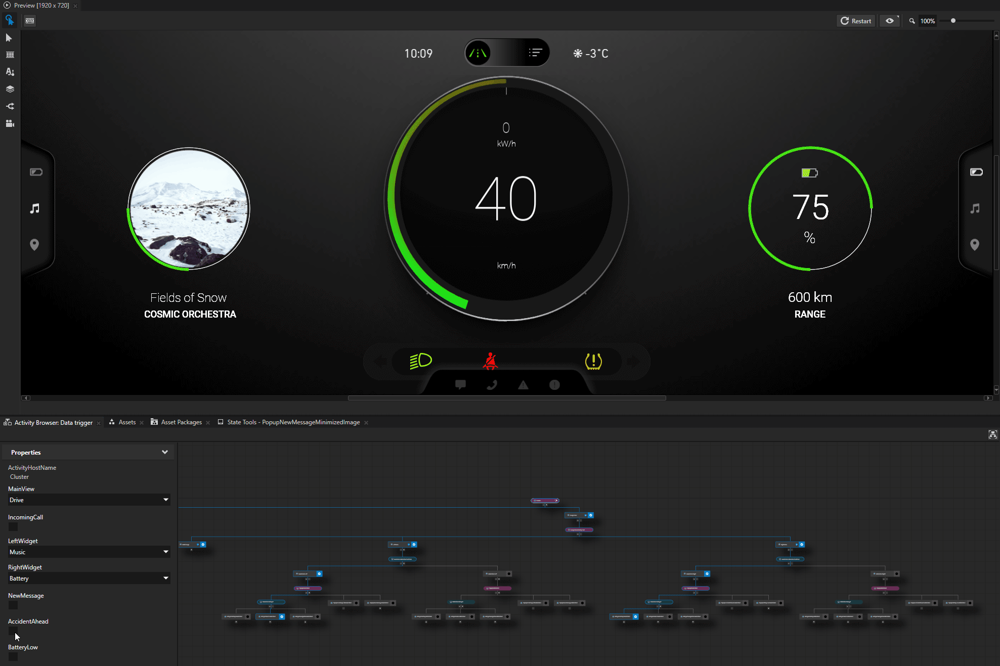

## UI Controls 界面控制
### Components  
在本仓库的这一步中主要学习自定义控件：
- Toggle Button  

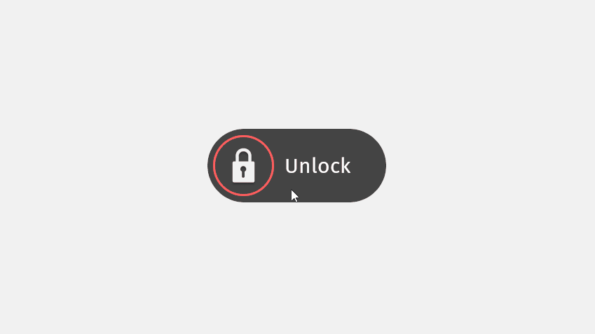

- Button  

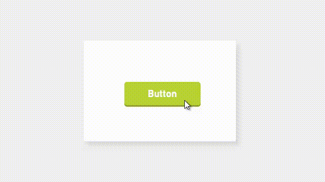

- Slider


- List Box

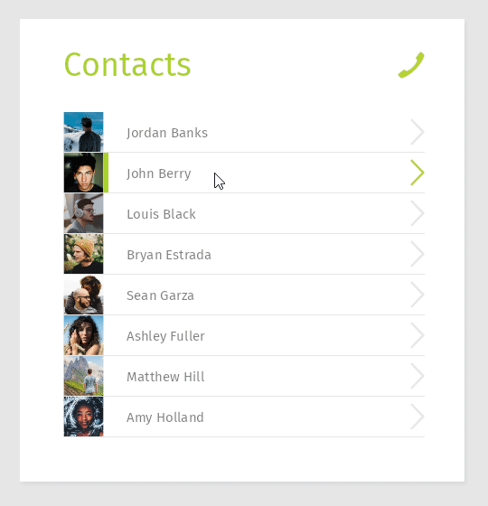

### Data Source
在本仓库的这一步中主要学习应用程序使用数据源插件：
- 数据源将用户界面与应用程序数据分离
- 通过定义 Kanzi Engine 数据源插件来定义数据源的格式和结构
- 定义 XML 数据源以及如何在 Kanzi Studio 项目中使用该数据源中的数据向 Kanzi 应用程序提供数据

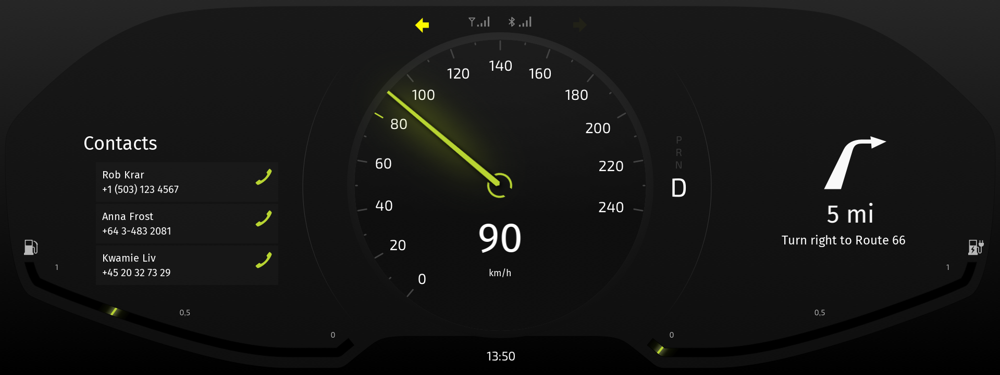

### Data-Driven Activities
在本仓库的这一步中主要学习使用数据驱动来显示Activity：
- 数据驱动的独占活动主机和列表数据源来创建一个设置面板  

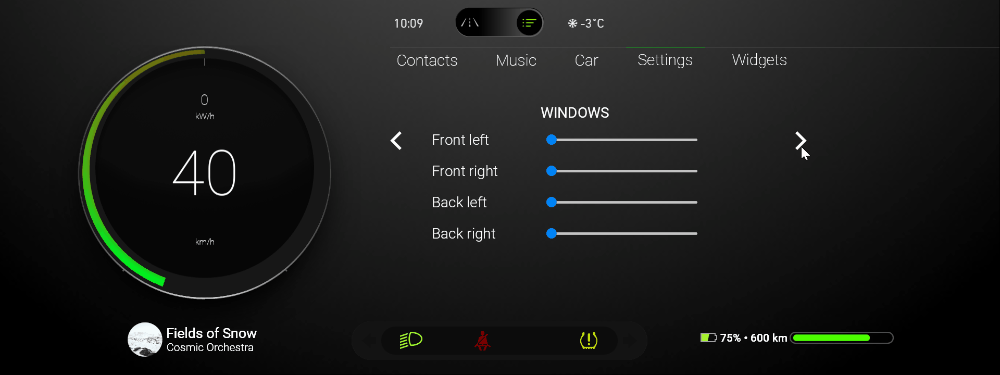

### Multi-Project  
在本仓库的这一步中主要学习组合多个 Kanzi Studio 项目来创建单个 Kanzi 应用程序：
- 使用公共资源（不用的资源尽量删除）
- 一个项目控制另外一个项目控件

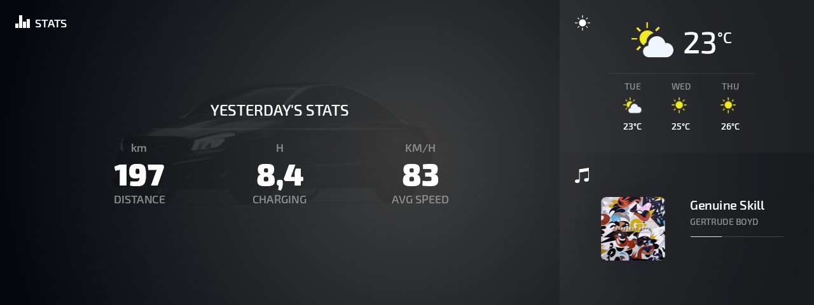

### Android Getting Started
在本仓库的这一步中主要学习使用 Kanzi Android 框架 (droidfw) 开始开发 Android 应用程序：
- 在 Android 视图中显示 Kanzi 预制件
- 使用 Kanzi Java API 访问和修改应用程序
- 创建一个 Android Activity并在该Activity中显示 Kanzi 内容

>[!NOTE]当您想要为 Android 平台创建应用程序，并且打算广泛使用 Android API 和服务时，请使用 Kanzi Android 框架 (droidfw)。
>Kanzi Android 框架 (droidfw) 是一个专门用于开发 Android 版 Kanzi 应用的框架。它公开了 Kanzi Java API，允许您完全用 Java 或 Kotlin 编写应用和插件代码。您无需编写任何 C++ 或 JNI 代码，但仍可以使用原生 Kanzi 插件。Kanzi Android 框架 (droidfw) 提供与 Android UI 的强大集成，包括支持多个同时基于 Kanzi 的视图以及 Kanzi 和 Android UI 元素的灵活组合。Kanzi Android 框架 (droidfw) 与 Android Choreographer 集成，后者在 Android UI 线程中运行 Kanzi 主循环任务。这使您可以从应用代码中使用 Kanzi Java API，而无需调度程序机制。


### Android Data Source (※)
在本仓库的这一步中主要学习使用为Android 版 Kanzi 应用程序创建数据源
- 使用 Kanzi Java API 创建数据源。
- 使用Android API来支持数据源。
- 确保与无法使用 Android API 的Kanzi Studio Preview兼容。

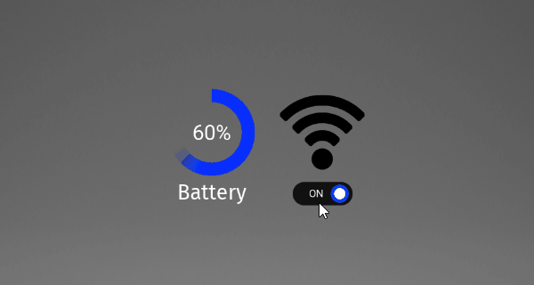

### Rotate a 3D Car model
在本仓库的这一步中主要学习使用Scroll View 2D 旋转3D车模

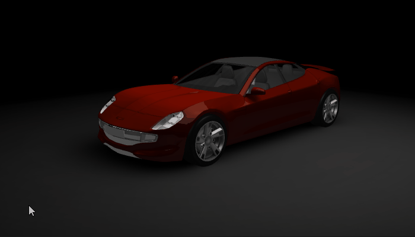

## Input 输入输出
### Input UI Navigation
本仓库的这一步中主要学习使用Input输入控制UI焦点

- 焦点获取和取消
- 焦点导航

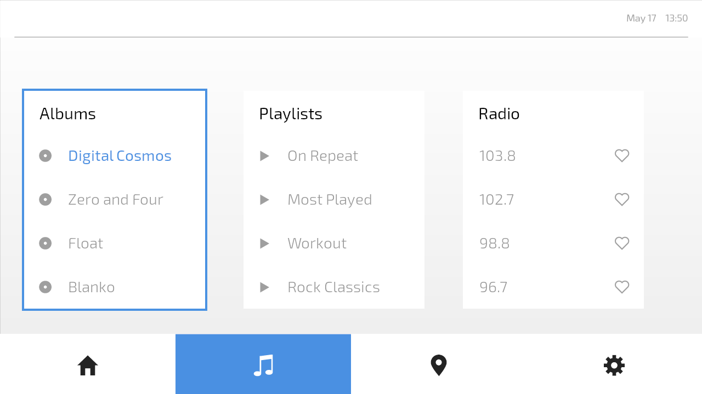

### Pan Zoom Tap
本仓库的这一步中主要学习Tab Zoom Pan 方式操作地图

- Pan
- Zoom
- Tap


### Drag and Drop
本仓库的这一步中主要学习使用C++代码控制拖动按钮效果：
- DragAndDropManipulator控制器实现拖拽事件
- Animation实现动画shake效果
- C++动态创建对象和绑定属性
- 容器对象迭代器使用

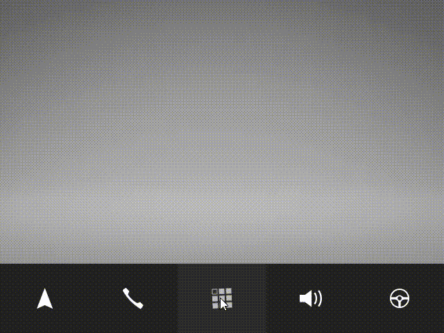

## Rendering 渲染
### Material and Textures
本仓库的这一步中主要学习材质和纹理的使用
- 导入Assets
- 创建材质和纹理
- 修改材质和纹理参数
- 双色车身

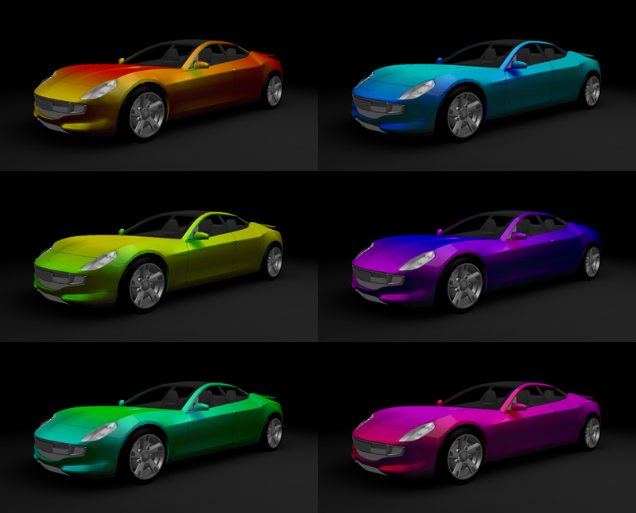

### Gaussian Blur 高斯模糊
本仓库的这一步中主要学习高斯模糊
- Gaussian blur
- 数据触发器
- 数据绑定
- Apply Property Action
- 状态管理器

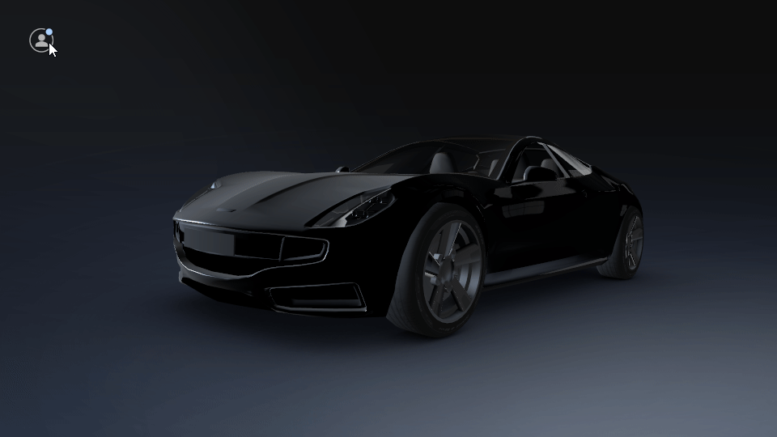

### Bloom 光晕
本仓库的这一步中主要学习车灯光晕效果
- 渲染通道
- 渲染材质文件和材质类型
- Rendering Pass相关组合
- 数据绑定
- bloom参数调节


### Stencil 模板
本仓库的这一步中主要学习如何使用标签、过滤器和渲染过程将模板应用于 3D 内容并仅渲染模板定义的区域。
- Tag和Tag Filter
- 渲染模板
- 渲染管线参数设置
- 模板测试

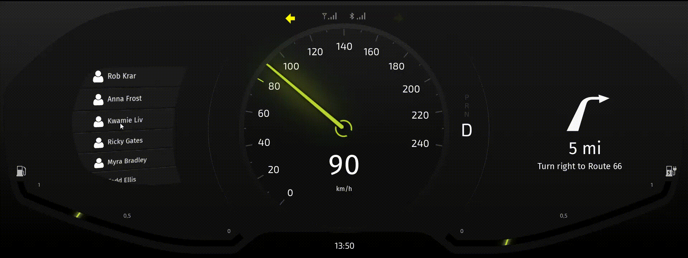

### Reflections
本仓库的这一步中主要学习反射
- 面剔除
- 渲染通道
- 对象源

<span style="color: red;">[**知识点**]</span>：
**"Reflections"**通常指的是物体表面反射的光线效果，这可以包括镜面反射、环境反射等多种形式。
具体来说，反射可以分为以下几种类型：
1. **镜面反射 (Specular Reflection)**:
   - 镜面反射是指光线从光滑表面反射出来的现象。这种反射遵循光的反射定律（入射角等于反射角），并且通常会产生清晰的反射图像。
   - 在3D渲染中，镜面反射通常用于模拟金属或光滑表面的高光效果。
2. **漫反射 (Diffuse Reflection)**:
   - 漫反射是指光线从粗糙表面散射出来的现象。这种反射不遵循特定的方向，而是向各个方向散射，因此不会产生清晰的反射图像。
   - 漫反射通常用于模拟非金属表面（如布料、木材等）的光照效果。
3. **环境反射 (Environment Reflection)**:
   - 环境反射是指物体表面反射周围环境的效果。这种反射可以捕捉到周围的环境光和颜色，并将其反射到物体表面。
   - 在3D渲染中，环境反射通常通过环境贴图（如立方体贴图）来实现，以模拟真实的环境光照效果。
4. **倒影 (Planar Reflection)**:
   - 倒影特指物体在平面上（如水面、镜子等）形成的反射图像。这种反射通常是镜面反射的一种特殊形式。
   - 在3D渲染中，倒影可以通过多种方法实现，包括使用反射贴图、屏幕空间反射（SSR）或预渲染的反射纹理。

&nbsp;&nbsp;在Kanzi中的应用在Kanzi中，反射效果可以通过不同的材质类型和设置来实现。以下是一些常见的方法：
1. **使用PBR材质**:•物理基础渲染（PBR）材质类型支持复杂的反射效果，包括镜面反射和环境反射。你可以通过设置金属度（Metallic）、粗糙度（Roughness）等参数来控制反射的强度和质量。
2. **环境贴图**:•使用环境贴图（如立方体贴图）来模拟环境反射。Kanzi 支持导入和使用HDR环境贴图，这些贴图可以提供非常逼真的环境光照效果。
3. **屏幕空间反射 (SSR)**:•屏幕空间反射是一种实时渲染技术，可以在屏幕上直接计算反射效果。这种方法适用于动态场景，但可能需要较高的计算资源。
4. **反射探针 (Reflection Probes)**:•反射探针是一种预计算的方法，它在场景中放置多个探针，每个探针捕获周围环境的反射信息。这些信息可以用来为附近的物体提供反射效果。


### Progressive Rendring
本仓库的这一步中主要学习渐进式渲染技术
- 多渲染管道
- 单帧渲染分成多帧渲染
- Tag和Tag Filter绑定

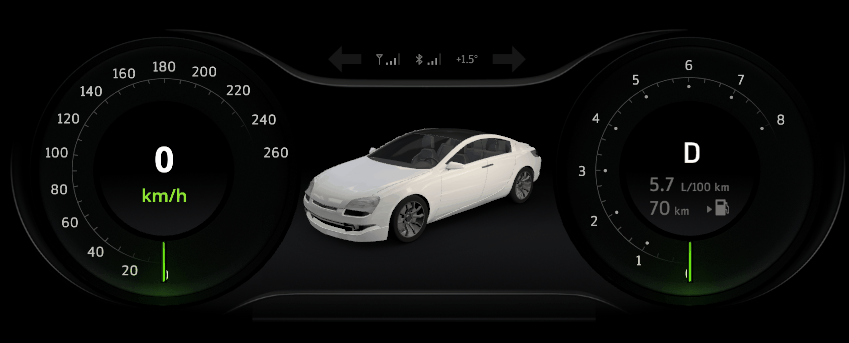

## Animations
### Keyframe Animations 
本仓库的这一步中主要学习关键帧动画
- Animation Clip Editor 动画剪辑编辑器
- Animation Clip
- Animation Data
- Timeline Entry
- Timeline Sequence

<span style="color: red;">[**知识点**]</span>：注意清除不需要的关键帧数据

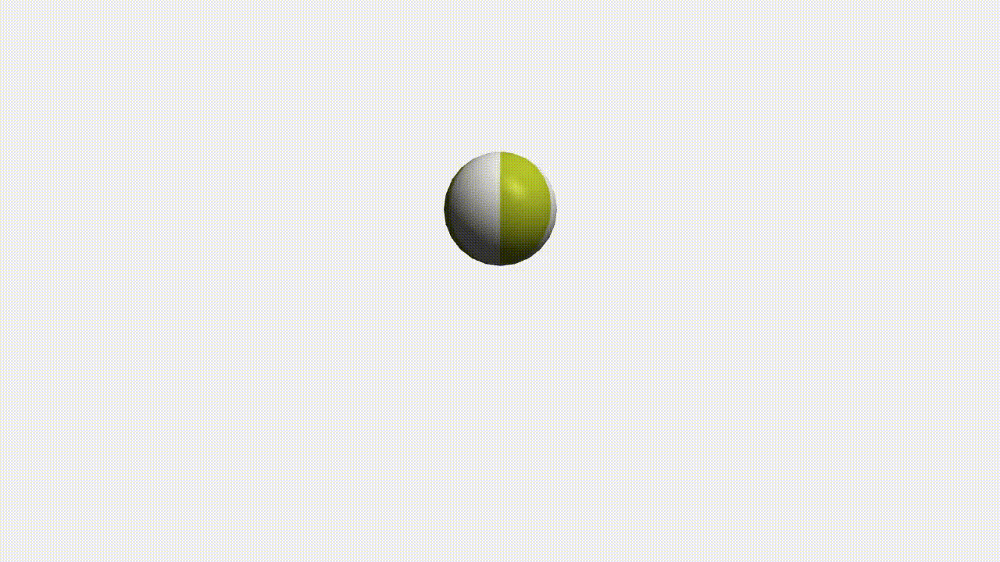

### Interpolate Animations
本仓库的这一步中主要学习插值动画
- 插值属性
- 插值触发器
- 插值表达式

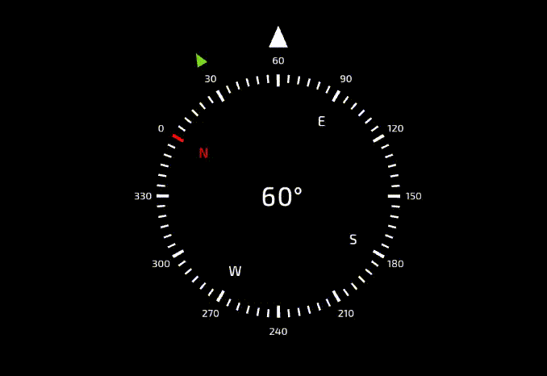

### Activity Transitions
本仓库的这一步中主要学习Activity直接的转换动画

- State Manager
- Trasition Editor
- Trasition Animations


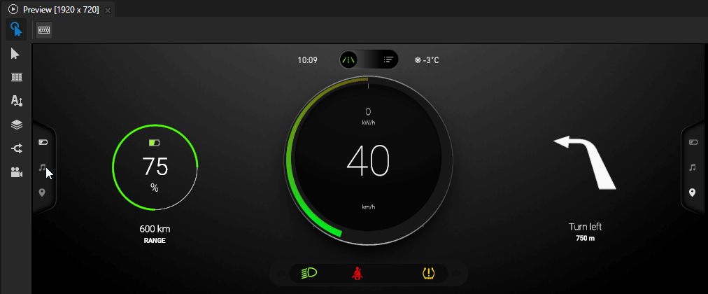

## Localization and Theming 
### Localization
本仓库的这一步中主要学习本地化应用
- 资源表
- 资源字段配置
- 触发器使用
- 资源加载
  
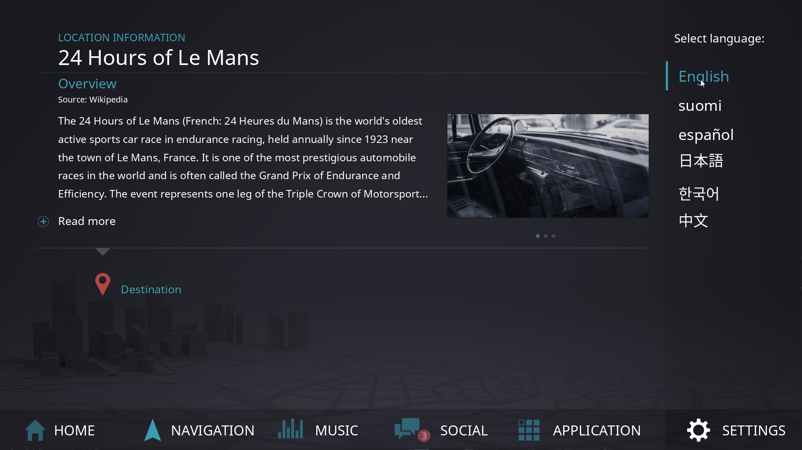

### Localization for right-to-left locales
本仓库的这一步中主要学习本地化中从右到左（阿拉伯文等）
省略

### Theming
本仓库的这一步中主要学习不同主题和风格切换
- 主题资源组
- 主题资源添加
- 主题资源属性设置
- Style风格设置
- 主题资源导出和API加载


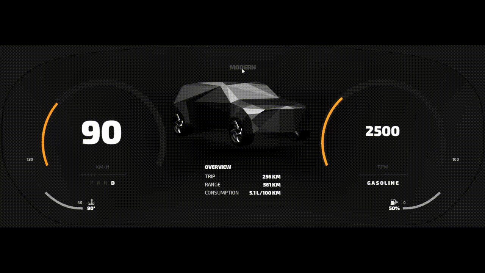

## Instrument cluster
### Gauges
本仓库的这一步中主要学习表盘控制
- control needle
- control proerty
- 自定义属性

<span style="color: red;">[**知识点**]</span> **属性** 提供了指定和检查节点的状态、外观和行为的方法。例如，属性可以定义颜色，指示是否按下按钮，或指定项的对齐方式。

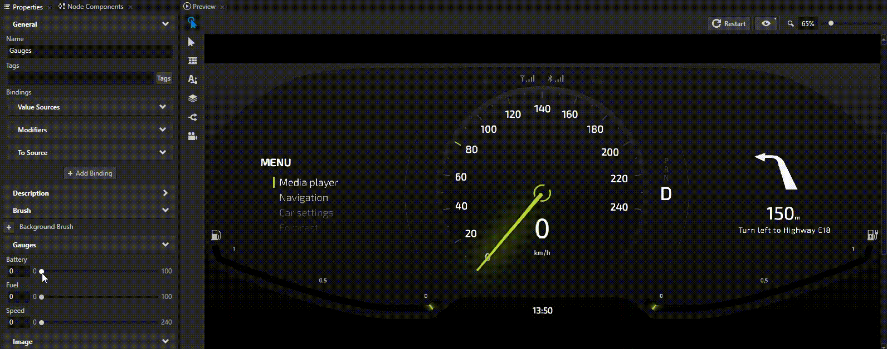   

### Indicator
本仓库的这一步中主要学习指示灯控制
- 油箱指示灯
- 头灯指示灯
- 属性绑定
- 状态管理器

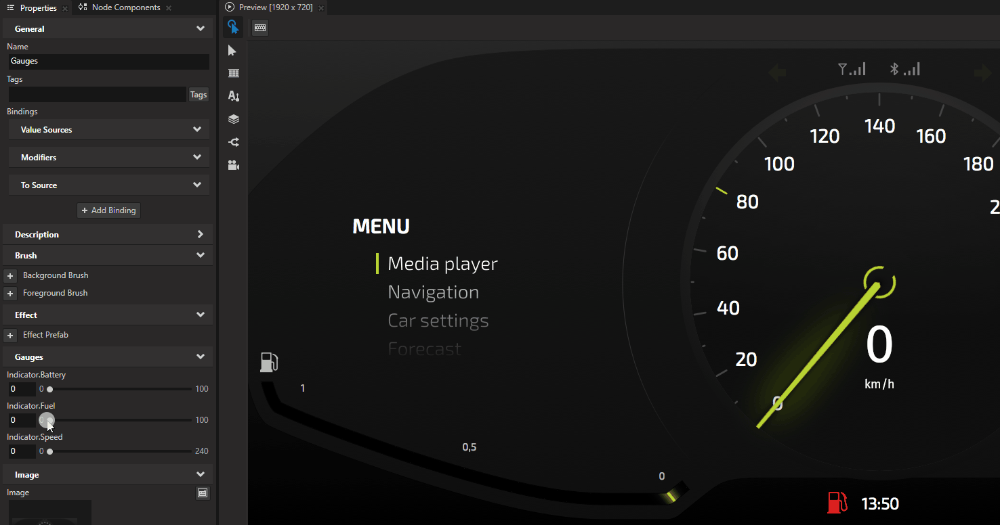   

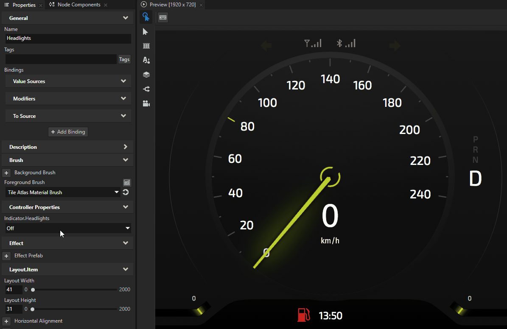   

### Dynamic Layout
本仓库的这一步中主要学习动态布局
- Grid Layout 2D
- bindings
- clamp function

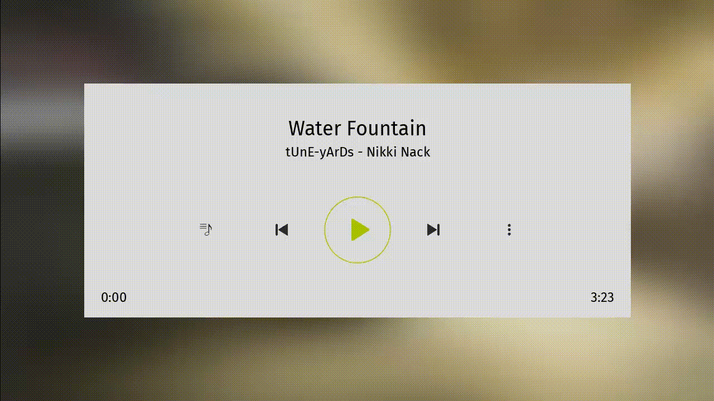   

<span style="color: red;">[**知识点**]</span> 动态布局的用户界面可响应设备屏幕方向和分辨率的变化

## C++ API
### Hello World
本仓库的这一步中主要学习在Kanzi Studio 应用程序中使用C++进行输出

<span style="color: red;">[**知识点**]</span> 虽然您可以在 Kanzi Studio 中为 Kanzi 应用程序创建大量 UI 逻辑，但如果您想充分利用 Kanzi，则必须通过 Kanzi Engine API 使用 Kanzi Engine。

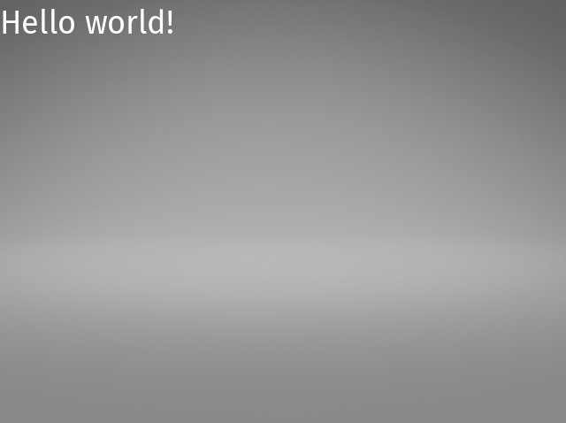   

### Program Activities with C++ Code Behind
本仓库的这一步中主要学习如何使用Code Behind工作流对Activities进行编程。您使用 C++ Code Behind使用户能够通过从小部件列表中拖放小部件来选择小部件.
- Code Behind workflow
- dragging and dropping a widget

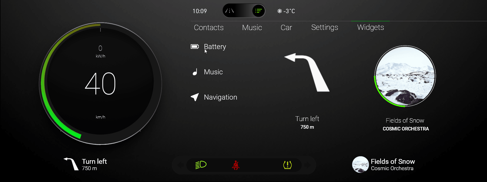   


# 应用程序性能和内存优化方式
1. **GPU Only**  
   •描述：资源仅部署到 GPU 内存，并在部署后立即从 RAM 中释放。  
   •特点：   
   •优点：最大限度地减少了 RAM 的占用，因为资源不会保留在系统内存中。  
   •缺点：如果需要重新加载资源（例如，应用恢复或切换场景），必须重新从存储介质加载，这可能导致较长的加载时间。  
   •适用场景：   
   •当你希望最小化 RAM 使用，且可以接受较长的加载时间时，适用于资源频繁更换但不常使用的场景。   
```cpp
// 假设有一个纹理资源
Texture* texture = new Texture("path/to/texture.png");
texture->setMemoryPolicy(Texture::MEMORY_POLICY_GPU_ONLY);

```
2. **GPU and RAM**   
   •描述：资源同时部署到 GPU 和 RAM 内存中。Kanzi 会根据平台和应用自动管理资源的加载和卸载。  
   •特点：   
   •优点：提供了更快的恢复时间，因为资源已经在 RAM 中缓存，可以在需要时快速重新部署到 GPU。  
   •缺点：消耗更多的 RAM，因为资源同时存在于两个地方。  
   •适用场景：   
   •当你需要快速恢复资源（例如，在 Android 设备上快速切换前后台），并且愿意用更多的 RAM 换取更好的用户体验时。  
```cpp
// 假设有一个纹理资源
Texture* texture = new Texture("path/to/texture.png");
texture->setMemoryPolicy(Texture::MEMORY_POLICY_GPU_AND_RAM);
```
3. **RAM Only**  
   •描述：资源默认保留在 RAM 中，仅在应用代码明确指示时才部署到 GPU 内存中。Kanzi 会在应用代码释放资源时将其从 GPU 内存中卸载。  
   •特点：   
   •优点：节省了 GPU 内存，只有在需要时才会将资源加载到 GPU，适合动态加载和卸载资源的场景。  
   •缺点：每次需要使用资源时都需要手动加载到 GPU，增加了开发复杂度。  
   •适用场景：   
   •当你有大量资源但不是所有资源都经常使用时，可以通过按需加载来优化 GPU 内存使用。  
```cpp
// 假设有一个纹理资源
Texture* texture = new Texture("path/to/texture.png");
texture->setMemoryPolicy(Texture::MEMORY_POLICY_RAM_ONLY);

// 在需要时手动加载到 GPU
texture->loadToGPU();

// 使用完毕后手动卸载
texture->unloadFromGPU();

```  

| 策略 | RAM 占用 | GPU 占用 | 加载时间 | 适用场景 |
| --- | --- | --- | --- | --- |
| **GPU Only** | 最小 | 长期 | 较长 | 资源频繁更换但不常使用 |
| **GPU and RAM** | 较大 | 长期 | 较短 | 快速恢复资源需求 |
| **RAM Only** | 较小 | 长期 | 按需 | 可变动态加载和卸载 |

    通过选择合适的资源管理策略，你可以优化应用程序的性能和内存使用。如果你的应用程序对 RAM 使用非常敏感，可以选择 GPU Only；如果你需要快速恢复资源，可以选择 GPU and RAM；如果你有大量资源但不是所有资源都经常使用，可以选择 RAM Only 并按需加载。

# Performance 性能
## 测量应用程序的性能范围
    Kanzi性能分析系统使您能够度量Kanzi应用程序的性能。您可以测量以下性能：
- 在应用程序启动和运行时。
- Kanzi应用程序代码。
- 资源加载和部署。

## 测量应用程序的性能方式
    你可以使用以下方式进行性能测量：
- **Profilers** 在应用程序启动和运行时以及您自己的应用程序代码期间测量Kanzi Engine不同部分的性能的分析器。剖析版本附带了几个性能剖析器。
- **Profiling categories**  剖析分类用于对剖析器进行分组，并确定要启用哪些剖析器。当您希望对自己的函数和作用域的性能度量进行分组时，请创建自己的类别。
- **Profiling macros** 用于创建和配置分析类别和分析器的分析宏。通过这种方式，您可以度量任何函数或范围的性能。
- **Performance HUD**  显示主循环任务的性能分析图。

## Startup Time Optimize 启动时间或加载时间优化
- **并行加载资源**  
    在多个线程中加载资源，以使用设备中的多个核心。使用并行资源加载在多个线程中加载和处理应用程序中的资源，并通过多个帧将资源部署到GPU.
- **异步加载资源**    
    异步加载资源以改进应用程序启动或响应。
- **启动时最小化加载资源**    
    首先加载一个kzb文件，其中包含您可以在应用程序启动时显示的最小数量的内容，例如加载屏幕。然后开始加载包含应用程序其余部分的kzb文件。
- **延迟加载资源**   
    在Kanzi Studio中重新组织应用程序的节点树。Kanzi在需要时加载资源。重新组织节点树以延迟资源加载，直到节点树中不太重要的部分变得可见为止。这样，应用程序可以跳过这些资源并更快地启动
- **删除未使用或重复资源**  
    查明资源是否正在使用，并卸载未使用的资源。这允许您创建复杂的应用程序，其中并非所有资源都可以同时放入内存。
- **资源压缩格式**  
    对于应用程序中的图像，请使用原始和压缩格式，而不是.png和.jpg格式。当您使用原始和压缩格式时，Kanzi需要在将数据发送到GPU之前处理更少的数据。
- **使用二进制shader** 
    使用二进制着色器。默认情况下，Kanzi在运行时编译所有着色器。当您使用二进制着色器时，您将删除编译步骤。
- **使用渐进式加载**  
    设计应用程序以支持渐进式加载。例如，在加载基本UI时显示加载屏幕，一旦基本UI加载并可操作，就为UI的其他部分预加载应用程序资源。
- **使用DeploymentQueueBudget配置**  
    对于Kanzi Android框架（droidfw）应用程序，使用DeploymentQueueBudget配置设置来控制Kanzi每一帧用于部署资源的时间。这个设置对启动时间有很大的影响。看到DeploymentQueueBudget。

## Animation Optimize 动画优化
- **删除不影响动画精度的关键帧**  
- **删除没有动画的动画数据通道**  
- **避免在关键帧之间过度使用bezier插值，因为bezier插值比线性、阶跃和平滑阶跃插值更昂贵。**  
- **在导入大量采样的动画后，检查关键帧是否使用Bezier插值。为了显著减少CPU工作负载，选择所有关键帧并使用线性插值。这很少对动画的视觉质量产生影响。**  
- **若要动态更改文本块节点中的文本大小，请使用“Render Transformation”或“Layout Transformation”属性的“Scale”属性字段，而不是使用“Font Size”属性。例如，当您想要动画化文本块节点中的文本大小时，可以使用此方法。当您使用Font Size属性来动态缩放文本时，Kanzi会为不同的字体大小创建多个纹理，并且不会从内存中释放它们。**  

## Images and Textures Optimize 图像和纹理优化
- **使用数据小的图像**
    优化应用程序性能的最简单方法是通过使用较小的数据大小来减少图像中的细节量。
- **图像格式压缩**
    Kanzi支持自适应可扩展纹理压缩（ASTC）、AMD纹理压缩（ATC）、爱立信纹理压缩（ETC）、PNG压缩和PowerVR纹理压缩（PVRTC），用于压缩纹理中使用的图像。
- **多核并行加载图像资源**
    当用户在多核处理器环境中运行Kanzi应用程序时，Kanzi会自动使用多个CPU内核将kzb文件中的GPU资源加载到RAM中。Kanzi允许您配置希望应用程序使用多少核。请参阅并行加载资源。
- **使用Mipmaps图像资源**
    使用mipmaps从一个大纹理中创建一组缩小比例的子层次。Mipmaps增加了三分之一的GPU内存使用，但在不需要采样完整纹理时提高了性能。无论何时缩放纹理节点，都可以使用mipmaps来提高性能。
- **使用纹理过滤**
    应用纹理过滤来提高质量或性能。如果您事先熟悉应用程序的行为，这种方法将非常有效。
- **使用Tile Atlas(贴图集)**
    通过减少应用程序在运行时必须进行的纹理切换的数量，使用贴图图集来提高应用程序的帧率。
- **OpenGL ES 2优化设置**
    OpenGL ES 2规范不需要对大小不是2次幂的纹理进行过滤或贴图处理。为了让Kanzi正确渲染你的纹理，请确保：
    - 目标设备支持GL_OES_texture_npot扩展。
    - 纹理的大小是2的幂。
    - 纹理有Mipmap模式属性设置为Base和Wrap模式属性设置为Clamp。
    - 在项目>属性中启用四舍五入图像尺寸到最接近的2次幂属性
- **图像Mipmap Mode 设置为Nearest**
    确保所有纹理都有Mipmap模式属性设置为至少最接近。使用Mipmap模式值基础只有非常小的纹理（例如，4 × 4像素或更小）。
- **图像纹理属性优化**
    使只包含平面颜色的纹理不大于4 × 4像素，并设置纹理设置属性：
    - Minification Filter to Nearest
    - Magnification Filter to Nearest
    - Mipmap Mode to Base
- **使用字形缓存纹理**
    使用文本块时，Kanzi为每种字体和字体大小组合创建字形缓存纹理。您可以设置字形缓存纹理的高度和宽度，以调整字形缓存纹理的大小，或者当它被填满时，或者优化您的Kanzi应用程序的性能。
- **删除图像中无效ICC配置**
    当您的Kanzi应用程序使用包含无效ICC配置文件的png图像时，Kanzi将在应用程序运行时向日志打印警告。要从所有png图像中删除ICC配置文件，在项目>属性中启用从png图像中删除ICC配置文件属性。
- **glTF纹理和图像资源优化**
    确保glTF资源中纹理或材料使用的所有图像资源都启用了“忽略嵌入颜色配置文件”属性。
- **图像资源设置sRGB Content属性**
    确保所有使用ASTC， ETC2， JPEG， PNG或PVRTC格式的图像资源都正确设置了sRGB Content属性：
    - 如果图像包含sRGB颜色信息，请将sRGB Content属性设置为enabled。这是默认设置。
    - 如果您为包含sRGB颜色信息的图像禁用sRGB Content属性，Kanzi可以将使用该图像的纹理渲染得比预期的更亮。
    - 如果图像包含非颜色信息，例如法线图、粗糙度图或遮挡图，请将sRGB Content属性设置为禁用。包含非颜色信息的纹理以线性格式存储。通过禁用sRGB Content属性，您可以设置Kanzi将图像数据直接传递给着色器
- **半透明图像优化**
    确保所有包含透明度的图像资源都正确设置了线性预乘法属性。
    - 线性色彩空间，将线性预叠属性设置为启用。这是默认值，结果是sRGB图像中的工件最少。
    - 图像的色彩空间，通常为sRGB，将线性预叠属性设置为禁用。这可以为传统颜色工作流创建的图像提供更好的结果。
  
## Mesh Optimize 网格优化
    网格和纹理在影响任何3D应用程序的性能方面都起着重要作用。为了提高Kanzi应用程序中的网格效率：
- **减少网格中的顶点数据量**
- **减少渲染顶点的数量**
- **从缓存中访问网格顶点**
- **通过设置筛选属性来优化网格的性能**
- **当网格的枢轴点居中于网格时，您可以对顶点属性使用半浮动精度。当你使用半浮动精度的顶点属性，而不是浮动，你减少了一半的网格数据大小**
- **当用户在多核处理器环境中运行Kanzi应用程序时，Kanzi会自动使用多个CPU内核将kzb文件中的GPU资源加载到RAM中**
- **使用实例渲染相同网格的大量副本**

## Rendering Optimize 渲染优化
    要优化应用程序的渲染性能，请考虑：
- **减少大量基于片段的计算的着色器**
- **减少场景变化引起的布局，重新计算会影响CPU的性能**
- **当属性类型启用了Affect Layout，并且节点上此类属性的值发生变化时，Kanzi将重新计算该节点的布局。请确保仅在需要时才重新计算布局。例如，每帧重新计算布局会降低应用程序的性能。只有当影响布局时，Kanzi自带的属性才会启用Affect Layout。对于自定义属性类型，您可以设置它们是否影响布局。**
- **将渲染工作负载分配到多个帧，以减少渲染整个帧所需的工作量和时间**
- **减少Overdraw**   
    过度透支会以增加填充率的形式降低GPU上的性能.
- **当渲染不透明的内容时，总是从前到后渲染。只有当你有一个很好的理由这样做时，才从后到前渲染**
- **因为透明节点的可视化依赖于它们后面有适当的数据，为了正确地解决混合方程，正确地呈现透明节点，您必须从后向前呈现它们**
- **减少Shader切换**        
    如果节点以需要在着色器程序之间过度切换的顺序呈现，则渲染速度可能会减慢
- **为每个渲染目标设置第一个Viewport节点的渲染通道，以清除所有缓冲区**
- **确保所有渲染目标不会被多次清除**
- **不为任何渲染目标多次清除颜色、深度或模板**
- **移动重叠的背景画笔。例如，如果RootPage节点有一个背景刷集，它的子节点也有一个背景刷集，从RootPage节点中删除背景刷**
- **在动画项目移动时以较低的质量渲染。提高了性能，但降低了质量**
- **若要动态更改文本块节点中的文本大小，请使用Render Transformation or Layout Transformation属性的“Scale”属性字段，而不是使用“Font Size ”属性。例如，当您想要动画化文本块节点中的文本大小时，可以使用此方法。当您使用Font Size属性来动态缩放文本时，Kanzi会为不同的字体大小创建多个纹理，并且不会从内存中释放它们**
- **避免不必要的填充**
- **与其实时渲染效果，不如将效果烘烤成纹理**        
    例如，创建纹理来模拟阴影和景深。提高了性能，但也增加了内存消耗。

### Progressive Rendering技术介绍 
&nbsp;&nbsp;**Progressive Rendering(渐进式渲染)** 是一种渲染技术，它将复杂的渲染任务分解成多个小部分，并在多帧中逐步完成这些部分。这种方法可以显著减少单帧的渲染时间，从而提高应用程序的性能和响应性。渐进式渲染通常用于处理非常复杂的场景或需要高计算量的渲染任务，如高质量的光照、阴影、反射等。  
**为什么使用渐进式渲染？**
1. 减少单帧渲染时间：  
   •渐进式渲染通过将渲染任务分布在多帧中，减少了每帧的渲染时间。这使得应用程序能够更快地响应用户输入，提供更流畅的用户体验。
2. 提高性能：  
   •对于资源密集型的渲染任务，渐进式渲染可以显著提高性能。通过分摊工作负载，GPU 可以更有效地利用其计算能力。
3. 实现高质量渲染：  
   •渐进式渲染允许在多帧中逐步累积渲染结果，从而实现更高的视觉质量。这对于需要复杂光照和全局光照效果的场景尤为重要。
4. 平滑过渡：    
   •渐进式渲染可以提供平滑的视觉过渡，因为每一帧都在逐步改进最终图像的质量。用户可以看到图像逐渐变得清晰和详细。

## Shader Optimize 着色器优化
在 Kanzi 应用程序中使用着色器的最佳实践是：

- **通过降低精度并将计算从片段移至顶点来优化片段着色器**

- **如果节点的呈现顺序需要在着色器程序之间进行过多切换，则渲染速度可能会变慢。请参阅减少着色器切换**

- **让 Kanzi Studio 编译代码并以二进制格式导出着色器。这样做可以减少应用程序的加载时间。请参阅使用二进制着色器**

- **当用户在具有多核处理器的环境中运行 Kanzi 应用程序时，Kanzi 会自动使用多个 CPU 核心将 kzb 文件中的 GPU 资源加载到 RAM 中**

    Kanzi 可让您配置应用程序要使用的核心数

- **确保着色器仅计算您使用的灯光数量。将应用程序中场景节点中的灯光数量限制为着色器计算的数量**

- **使用着色器工具（例如 PVRShaderEditor）获取有关着色器性能成本的全面信息**

- **确保着色器中没有错误或警告**

- **将您想要在多个着色器中使用的功能放入单独的着色器中，并重复使用该着色器代码。请参阅重复使用着色器代码**

## Decrease the size of kzb file 减少kzb文件大小
    通过删除项目不使用的内容，您可以减小项目的 kzb 文件的大小：
- **完成项目后，最好删除项目未使用的所有资源和预制件**
- **如果您的项目不使用资源或节点，您可以通过排除此类项目来优化 Kanzi 应用程序的大小**
- **删除不包含任何动画的动画数据通道**
- **删除打开项目时 Kanzi Studio 生成的临时文件**

# 公共组件集合
## ColorPicker
    该组件实现了一个公共的颜色选择器案例。
    - 用户通过拖动环形圈进行颜色选择
    - 中间正方形会显示对应选择的颜色效果
    - 整个组件有阴影效果控制-shadow effect 2d

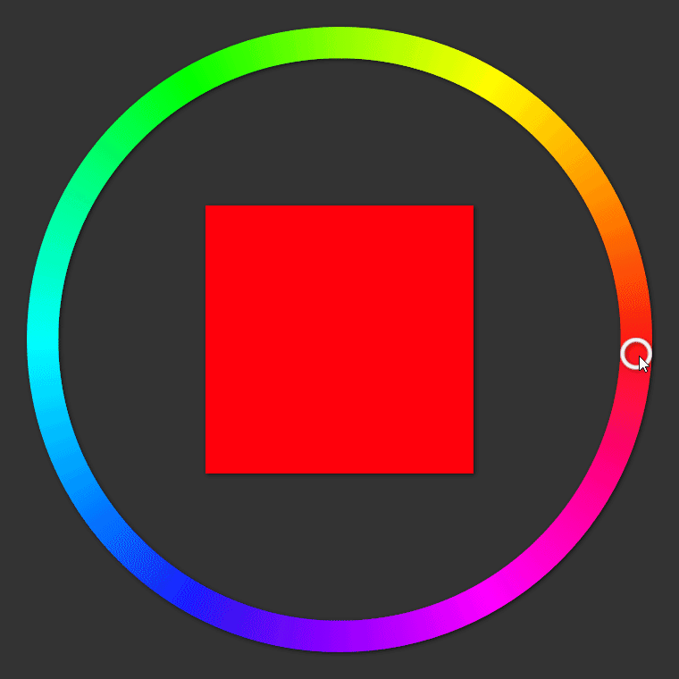   